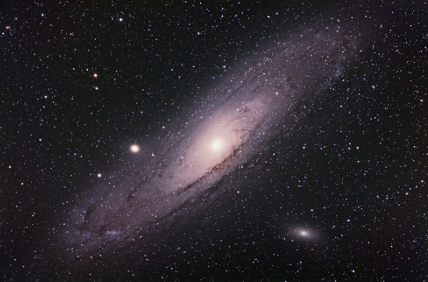

# AstroBin's Space-Object-Alias-Map (SOAM)

**Salvatore Iovene's Website**: https://app.astrobin.com/explore/iotd-tp-archive#iotd

## OBJECTIVE
I have provided a Haystack ElasticSearch synonyms file to Salvatore Iovene's open source AstroBin website improving its ability to search for images of space objects either by name or by a catalogue ID.

## PURPOSE
With millions of astronomical objects listed across 14,000+ catalogues it can be quite confusing trying to know exactly what name to call that majestic looking spec in the sky. Is that M 31 or is that the Andromeda Galaxy... or is it NGC 224? A synonym file mapping each space object alias will help AstroBins search engine return the desired photos no matter which naming convention the user searches by.


**Photo Credit**: "M31 180 sec final copyL" KevC (user name), 2011 https://www.astrobin.com/304/?q=m31

**A Note on the Name:** The SOAM class stands for "The Space Object Alias Map"  class, which I've created to help lead and organize the development of the synonym file. The word "soam" is defined as "... a chain by which a leading horse draws a plough. A horse-lead." 

## APPROACH
Below is a summary of the FILES created and the steps taken to build up and create the final synonym file:

1) FILE - **`AstroCatelogues.xlsx`**: Wrangled some starting "seed aliases" from various online sources into a spreadsheet. (used at a later step)

2) FILE - **`simbad_alias_search.py`**: Wrote the "simbad_alias_search.py" script to manage pulling all aliases (identifiers) of a given space object name from the SIMBAD database using astroquery using my own queue system.

3) FILE - **`soam_class.py`**: Wrote the "soam_class.py" to help build up / connect up all the fractured alias associations found in the seed data `AstroCatelogues.xlsx` as well as the SIMBAD database

4) FILE - **`soam_building.ipynb`**: Is a notebook where I've detailed how the SOAM was built. 

**Examples of a SOAM data structure:**

*CODE EXAMPLE*:
``` Code:
    t = Soam()
    cleaned_bulk = 
    [["a","b","c"],["c","d"],["e","f"]] # snippits of associations (not fully associated yet)
    t.add_associations(cleaned_bulk)
    print(t.all_names())
    print(t.all_aliases())
    print(f"'c' is also known as {t.get_aliases('c')}")

    #RETURNS:
    #    {'d': 0, 'b': 0, 'a': 0, 'c': 0, 'f': 1, 'e': 1}
    #    {0: {'d', 'b', 'a', 'c'}, 1: {'f', 'e'}}
    #    'c' is also known as {'d', 'b', 'a', 'c'}
```

*VISUAL EXAMPLE*:


5) 

## KEY FINDINGS
[ consider adding figures / graphs ]

## CONSIDERATIONS
[ explain model choices and other project considerations / decisions made ]

## FINISHED PRODUCT
[ show off the end result... use pictures if you can... ]